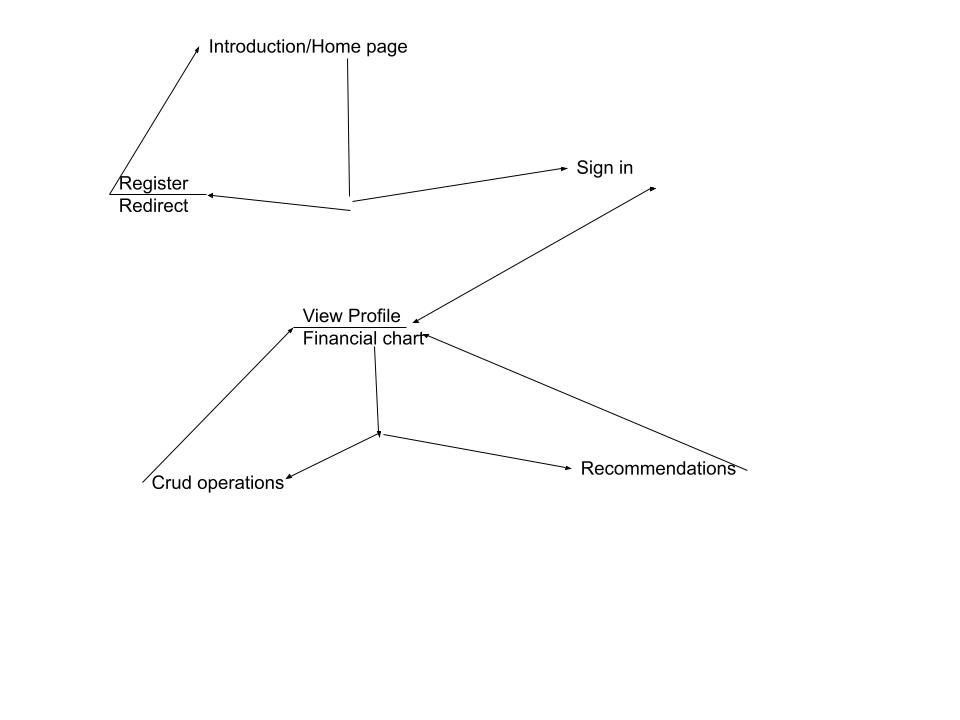
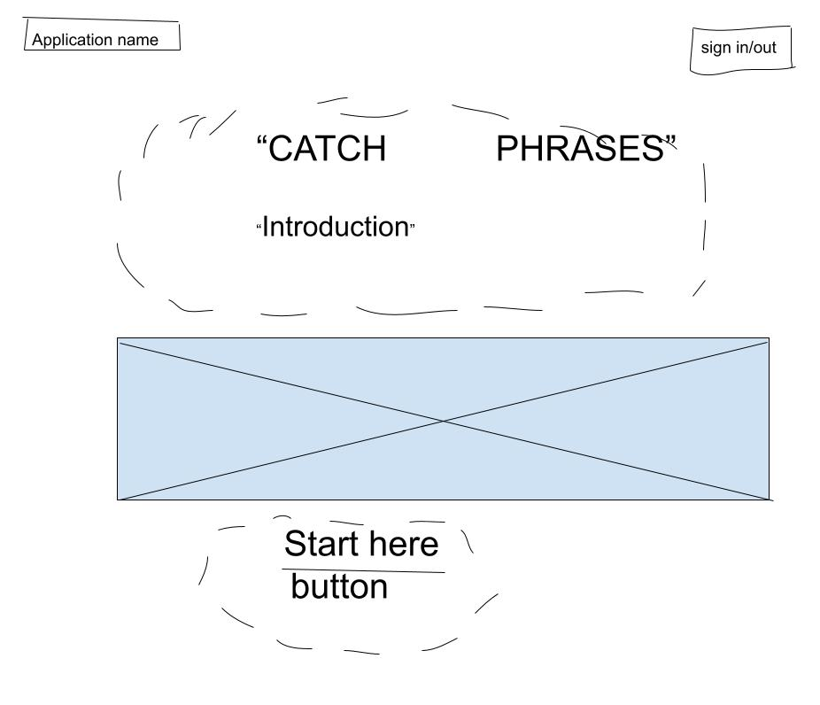
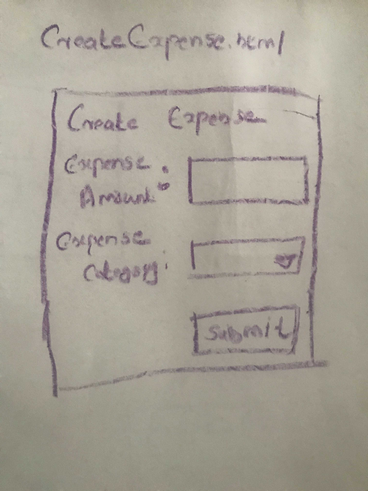

# Project Planning
For this assignment, you'll create some initial plans for your project.

## Assignment Description
[Project Planning Assignment](https://education.launchcode.org/liftoff/modules/assignments/project-planning)

## Submission Instructions

### Wireframes

Include at least 3 wireframes here, adding images or files to your repository as necessary. Format them as a bulleted/unordered list with links to the files.

* 

* 

* 

* 

### Project Tracker

https://trello.com/b/FBIAnWAH/financial-budget-planning

### Project Repo Link

https://github.com/DevJoshR/Financial_Budget
